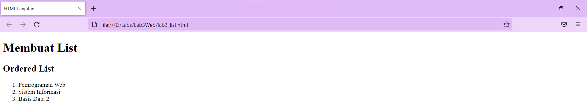
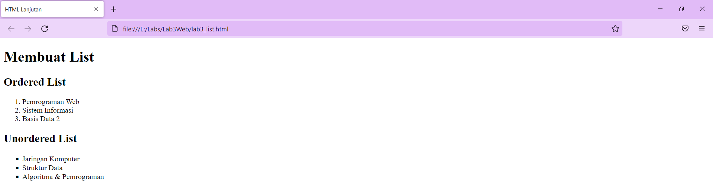
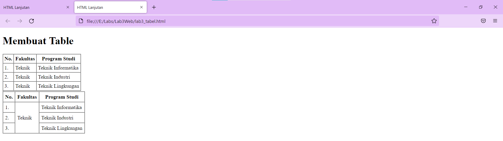
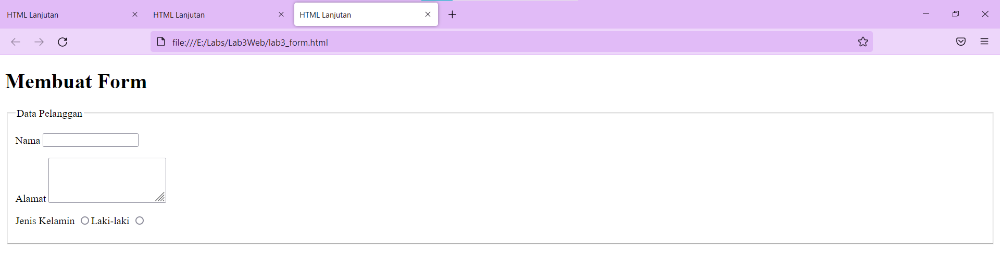
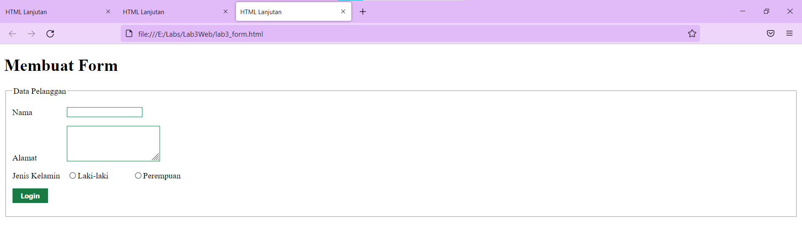

# Membuat list

# Menambahkan kode untuk membuat Unordered List

# Menambahkan kode untuk membuat description list
# Menambahkan dan Membuat Tabel

# Menambahkan dan mengatur margin dan padding pada cel data
# menggabungkan sel data
# Membuat Form

# Menabahkan Style pada Form

